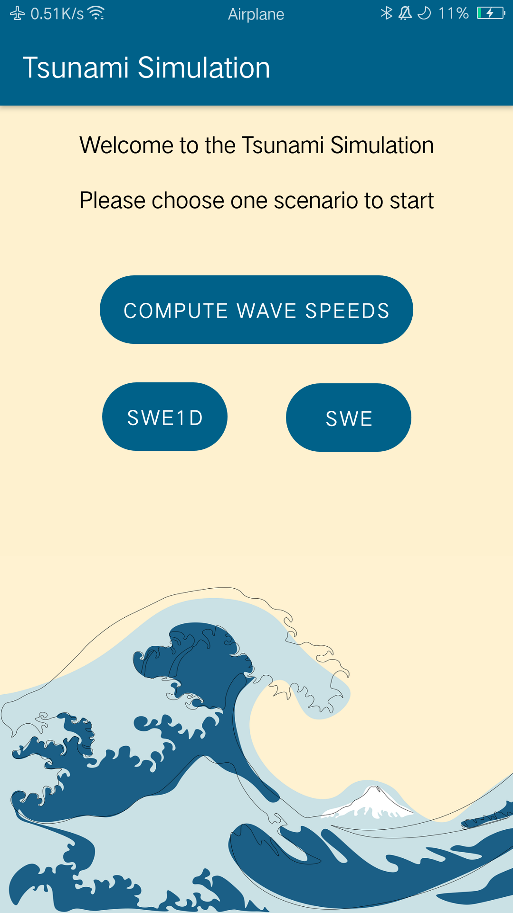
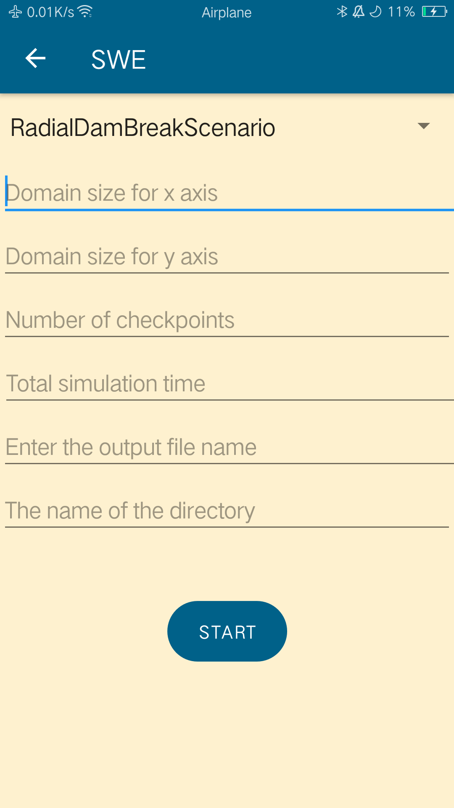
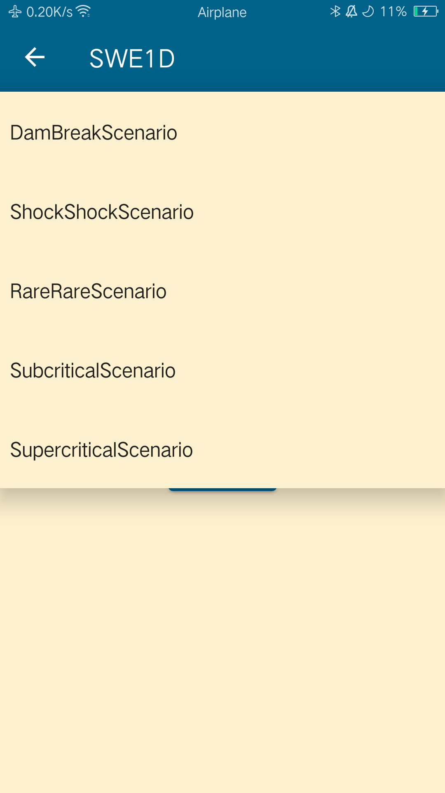
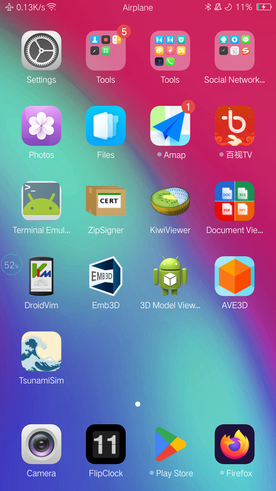

# SWE-Android
This project is based on the following 2 SWE projects  
https://github.com/TUM-I5/SWE  
https://github.com/TUM-I5/SWE1D  
Note: Writing files into storage is currently only supported by Android 9.0 or below 

# Screenshots:
 
 

